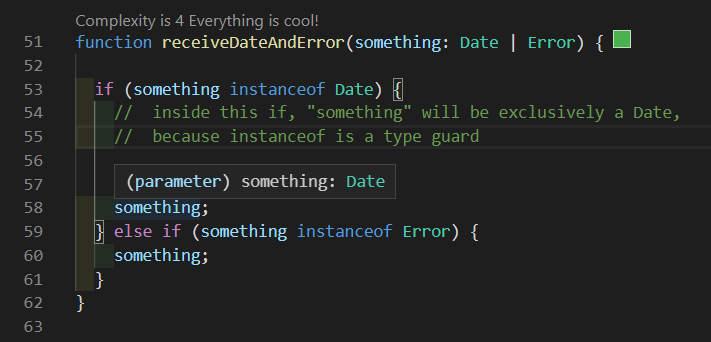

# Enum Type Guard

## About
A type guard is a method or keyword with power of something like cast in TypeScript.
When a type guard is used to check the type of an information in a conditional structure, the following code assume the validated type as the information type.



This feature is basically the Type Guard to identify enum data.

## Usage

```typescript
import { enumTypeGuard } from '@taipescripeto/basic';

/**
 * The application domain
 */
enum PokemonType {
  FIRE = 'FIRE',
  GRASS = 'GRASS',
  WATER = 'WATER'
}

interface Pokemon {
  name: string;
  type: PokemonType;
}

/**
 * External data collect (an api for example)
 */
const externalDataAboutPokemon = JSON.parse('{"name":"Charmander","type":"FIRE"}');

/**
 * Type Guard function
 */
function isPokemon(pokemonIGuess: unknown): pokemonIGuess is Pokemon {
  //  If it is null or isn't an object, isn't a Pokémon model
  if (!pokemonIGuess || !(pokemonIGuess instanceof Object)) {
    return false;
  }

  //  ignore that
  const someObject = pokemonIGuess as { [prop: string]: unknown };

  //  the type check
  if (
    !(typeof someObject.name === 'string' &&
      enumTypeGuard(someObject.type, PokemonType))
  ) {
    return false;
  }

  return true;
}

if (isPokemon(externalDataAboutPokemon)) {
  externalDataAboutPokemon
}
```

You can see in this print the TypeScript recognizing the external data as an enum:
